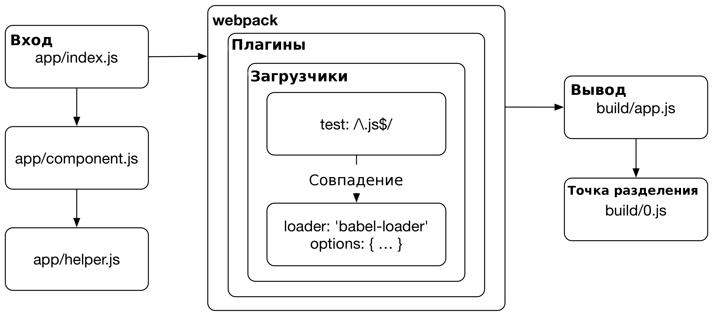

# Что Такое Webpack

Webpack — это **сброщик модулей**. Webpack может позабоиться о сборке проекта, вместе с отдельным менеджером задач. Однако, граница между сборщиком и менеджером задач ныне размыта, благодаря сообществу разработчков плагинов для webpack. Иногда эти плагины используются для выполнения задач, которые выходят за рамки изначального предназначения webpack'а, например — очистка папок сборки или деплой сборки.

React, и **Горячая Замена Модулей** (Hot Module Replacement — HMR) помогли популяризировать webpack, что привело к использованию webpack и в других окружениях, например в [Ruby on Rails](https://github.com/rails/webpacker). Несмотря на название, webpack, в своем применении, не ограничен вебом. Он может так-же хорошо справляться и со сборокой других проектов, о чем мы поговорим в главе *Целевые Платформы*.

T> Если вы хотите более детально ознакомиться с разнообразными сброщиками, и их историей, ознакомтесь с приложением *Сравнение Инструментов Для Сборки*.

## Webpack Опирается на Модули

Даже самый скромный проект, который вы хотите собрать с использованием webpack содержит **ввод** и **вывод**. Процесс сборки начинается с опредленных пользователем **входов**. Входы, по своей сути, являются **модулями** и могут ссылаться на другие модули, через ключевое слово **import**.

Когда вы собираете свой проект с использованием webpack, он проходится по всем импортам, с целью постройки **графа зависимостей** проекта, и затем генерирует **вывод**, основаный на конфигурации. Дополнительно, вы можете определить, так называемые **точки разделения** *(split points)* что бы создать отдельные сборки внутри самого кода проекта.

Webpack из коробки поддерживает ES2015, CommonJS, и формат модулей AMD. Механизм загрузки работает так-же хорошо и с CSS, с поддержкой операторов `@import` и `url()` через css-загрузчик — *css-loader*. Вы так-же можете найти плагины для широко спектра задач, как, например, минификация, интернационализация, HMR и другие.

T> Граф зависимостей является ориентированым графом, который описывает, каким образом вершины графа связаны между собой. В таком случае, определение графа задается ссылками (`require`, `import`) между файлмаи. Webpack статически проходится по всем сслыкам без выполнения исходного кода для построения необходимого для сборки графа.

## Процесс Выполнения Webpack'а



Webpack начинает свою работу с **входов**. Обычно ими являются JavaScript-модули, с которых webpack начинает процесс поиска зависимостей. Во время этого процесса, webpack ищет совпадения между входными файлами и настройками **загрузчиков** *(loaders)*, которые говорят webpack'у как обрабатывать такое совпадение.

{pagebreak}

### Процесс Разрешения Зависимостей

Вход, по своей сути, является модулем. Когда webpack таковой находит, он пытается сопоставить вход с файлом вашей файловой системы, используя конфигурацию входа `resolve`. Вы можете заставить webpack производить поиск по указаным папкам, в дополнение к папке *node_modules*. Кроме того, есть возможность настроить сам процесс поиска совпадения в расширениях файлов, а так-же определить свои особые псевдонимы для папок. Глава *Обработка Пакетов* объясняет эти идеи более детально.

Если процесс разрешения зависимостей прошел неудачно, webpack отображает ошибку выполнения *(runtime error)*. Если webpack разрешил все зависимости между файлами без проблем, он отправляет на обработку найденные файлы загрузчикам, основываясь на конфигурации этих самых загрузчиков. Каждый загрузчик преобразует содержимое модуля по-своему.

Вы можете настроить процесс сопоставления файлов и загрузчиков как вам угодно, например, по типу файла или его местонахождении в вашей файловой системе. Гибкость Webpack'а даже позволяет вам применять специфичные преобразования к файлам, основываясь на информации о том, *в каком месте* файл был импортирован в проект.

Идентичный процесс разрешения зависимостей применяется webpack'ом и к загрузчикам. Webpack позволяет вам применять аналогичную логику к файлам, при определении того, какой загрузчик он должен использовать. По этой причине, у загрузчиков есть свои собственные настройки. Если webpack не может выполнить процесс поиска загрузчика, он так-же возвращает ошибку выполнения.

T> Webpack под капотом опирается на пакет [enhanced-resolve](https://www.npmjs.com/package/enhanced-resolve) для разрешения зависимостей.

### Webpack Производит Процесс Разрешения Зависимостей Для Файлов Любого Типа

Webpack разрешает зависимости в любом модуле, который он находит во время построения графа зависимостей. Если вход содержит в себе зависимости, процесс будет выполнен рекурсивно для каждой из зависимостей до тех пор, пока процесс поиска зависимостей не будет завершен. Webpack может выполнить этот процесс с любым типом файла, в отличии от узконаправленных инструментов, вроде Babel или компилятора Sass.

Webpack дает вам возможность управлять обработкой различных ассетов, которые он находит. Например, вы можете разрешить **встраивать** ассеты в файлы вашей JavaScript сборки что бы избежать дополнительных запросов. Webpack так-же позволяет вам прибегать к различным техникам, как, например CSS-модули, что бы связать стили с компонентами, и избежать проблем обычных CSS стилей. Эта гибкость и сделала webpack таким востребованным.

Несмотря на то, что webpack в большинстве случаев используется для сборки JavaScript, он может захватывать различные ассеты, такие как изображения или шрифты и выделять их в отдельные файлы. Входы — это только отправная точка для процесса сборки. То, что webpack отдаст вам на выходе, полностью зависит от того, как вы его настроите.

### Процесс Выполнения

Когда все загрузчики найдены, webpack запускает выполнение совпадающих загрузчиков снизу вверх, и с права на лево (`styleLoader(cssLoader('./main.css'))`) вместе с тем, пропуская каждый модуль через найденный загрузчик по очереди. В результате, вы получаете вывод, который webpack вставит в окончательную **сборку**. Глава *Определение Загрузчиков* описывает это подробно.

Если выполнение всех загрузчиков было завершено без ошибок, webpack включает исходный код в итоговую сборку. **Плагины** позволяют вам перехватывать **события выполнения** *(runtime events)* на различных этапах процесса сборки.

Несмотря на то, что загрузчики способны на многое, они не предоставляют достаточного функционала для дополнительных задач. В то время, как плагины  могут перехватывать **события выполнения** которые им предоставляет webpack. Хорошим примером является извлечение из сборки, которое выполнятеся плагином `MiniCssExtractPlugin` который, если используется с загрузчиком, извлекает CSS из сборки в отдельные файлы. Без него, CSS был бы встроен в итоговоый JavaScript, потому что webpack по-умолчанию воспринимает любой код как JavaScript. Идея подобного извлечения описана в главе *Разделение CSS*.

### Завершение

После того, как каждый модуль был обработан, webpack записывает **вывод**. Вывод включает в себя загрузочный скрипт с манифестом, который описывает каким образом запустить результат в браузере. Манифест может быть вынесен в отдельный файл, что будет описано далее в этой книге. Вывод может отличаться, в зависимости от платформы, которую вы используете (платформа web это не единственный вариант).

И это еще далеко не все, что связано с процессом сборки. Например, вы можете определить конкретные **точки разделения** *(split points)*, на которых webpack будет создаыать отдельные пакеты, которые загружаются на основе логики приложения. Эта идея описана в главе *Разделение кода*.

## Сборка Через Конфигурацию

По своей сути, webpack опирается на конфигурацию. Ниже представлен пример такой конфигурации, основанной на [официальном руководстве webpack](https://webpack.js.org/get-started/) который охватывает основные моменты:

**webpack.config.js**

```javascript
const webpack = require("webpack");

module.exports = {
  // Место начала сборки
  entry: {
    app: "./entry.js",
  },

  // Место вывода
  output: {
    // Вывод в ту же самую папку
    path: __dirname,

    // Захватывать имя из входа, используя паттерн
    filename: "[name].js",
  },
 
  // Каким образом разрешать зависимости в найденных ссылках (import)
  module: {
    rules: [
      {
        test: /\.css$/,
        use: ["style-loader", "css-loader"],
      },
      {
        test: /\.js$/,
        use: "babel-loader",
        exclude: /node_modules/,
      },
    ],
  },

  // Какие дополнительные обработки необходимо выполнить
  plugins: [
    new webpack.DefinePlugin({ ... }),
  ],

  // Настройка алгоритма разрешения модулей
  resolve: {
    alias: { ... },
  },
};
```

Модель конфигурации webpack'а может показаться немного непрозрачной, а конфигурационный файл — монолитным и громоздким. Понимание того, что делает webpack может быть сложным, до тех пор, пока вы не понимаете идей, стоящих за ним. Предоставление знаний для ручной настройки webpack'а является одной из основных целей этой книги.

## Хэширование Ассетов

С помощью webpack, вы можете вставить хэш в имя каждой сборки (например: *app.d587bbd6.js*) что бы сделать неактуальными сборки на стороне клиента при внесении изменений. В идеальном случае, разделение сборки (bundle-splitting) позволяет клиенту перезагрузить только небольшую часть данных.

## Горячая Замена Модулей

Вам скорее всего знакомы такие инструменты, как [LiveReload](http://livereload.com/) или [BrowserSync](http://www.browsersync.io/). Эти инструменты автоматически перезагружают страничку в браузере, когда вы сохраняете изменения в файлах. *Горячая Замена Модулей* (HMR) еще на шаг впереди. Если вы используете React, HMR позволяет приложению поддерживать свое состояние без принудительной перезагрузки. Несмотря на то, что звучит не очень воодушевляюще, на практике это может сыграть большую роль.

HMR так-же может быть доступен в Browserify с помощью пакета [livereactload](https://github.com/milankinen/livereactload), так что HMR это не эксклюзивная особенность webpack.

## Разделение Кода

Кроме HMR, у webpack есть еще много обширных возможностей. Webpack позволяет вам разделять код различными способами. Вы можете даже загружать код динамически по мере запуска вашего приложения. Такая ленивая загрузка может пригодиться, особенно для крупных приложений, поскольку зависимости могут быть загружены «на лету» по мере необходимости.

Даже небольшие приложения могут извлечь выгоду из разделения кода, поскольку это позволяет пользователям быстрее получать в свои руки что-то рабочее. В конце концов, производительность — это особенность (англ. *Performance is a feature*). Базовые знания основных техник стоят того.

## Заключение

Webpack обладает очень длинной кривой обучения. Но не смотря на это, его стоит изучить, учитывая, сколько времени и усилий он может сэкономить в долгосрочной перспективе. Чтобы лучше понять, чем он отличается от других инструментов, ознакомтесь с [официальным сравнением с другими инструментами](https://webpack.js.org/comparison/).

Webpack не решит всех проблем. Однако он решает проблему сборки. Это вызывает меньше беспокойства во время разработки. С использованием одних только *package.json* и webpack можно уйти очень далеко.

Резюмируем:

* Webpack это **сборщик модулей**, но вы так-же хорошо можете использовать его в качестве менеджера задач.
* Под капотом, webpack опирается на **граф зависимостей**. Webpack проходится по исходному коду что бы построить граф, и в последствии, использует полученную информацию вместе с конфигурацией что бы создать сборки.
* Webpack опирается на **загрузчики** и **плагины**. Загрузчики исполняются на уровне модулей, в то время, как плагины опираются на хуки, предоставленные webpack'ом и имеют лучший доступ к самому процессу выполнения.
* **Конфигурация** webpack'а описывает то, как именно ему необходимо преобразовывать части графа и какой результат сгенерировать. Части этой информации могут быть втроены в сам источник, если вы используете функции вроде **разделения кода**.
* **Горячая Замена Модулей** (HMR) помогла популяризировать webpack. Эта особенность может улучшить процесс разработки, путем обновления кода в бразуре без необходимости полной перезагрузки страницы.
* Webpack может генерировать **хэши** для имен ваших файлов, что позволяет вам сделать предыдущие сборки неактуальными, в то время как вы вносите изменения.

В следующей части книги вы научитесь создавать конфигурацию, используя webpack, и в тоже самое время, узнаете больше о его основных концепциях.

T> Если вы до сих пор не уверены, зачем вам нужен webpack или почему сборщики необходимы, почитайте [Почему я должен использовать Webpack?](http://tinselcity.net/whys/packers).
